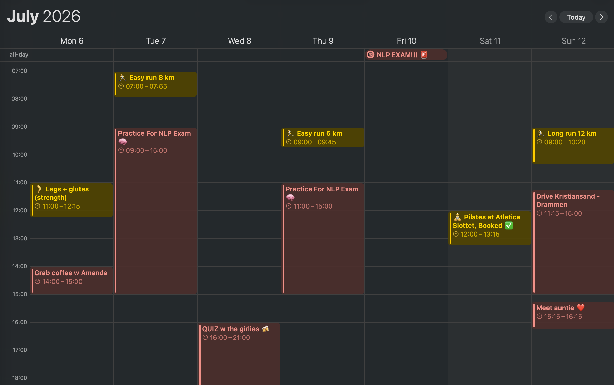

# TreningsAgent

A personal training assistant that runs on Cursor (or any MCP client) with live
access to:

- **Notion** (read) — Q3 training program on [Workout Coach](https://www.notion.so/Workout-Coach-39427249eb4d806a8686d0ebc552d487)
- **Garmin Connect** (read) — running, **strength sessions**, sleep, HRV, readiness
- **Apple Calendar** (read/write Trening only) — schedule sessions around availability
- **SiO Athletica** gym booking (read + optional booking)

Goal it's set up for: **Trondheim Halvmaraton at 5:25/km pace** (see `AGENTS.md`).

### Example week on Apple Calendar

Training sessions land on the **Trening** calendar around life (study, social, travel):



## Layout

```
.cursor/mcp.json        MCP server config for Cursor
servers/
  ibooking_client.py    SiO/iBooking HTTP client (reverse-engineered)
  sio_gym_mcp.py        MCP server: list/book/cancel SiO classes
  garmin_mcp.py         MCP server: read-only Garmin Connect
  notion_mcp.py         MCP server: Q3 program on Notion Workout Coach page
  notion_client.py      Notion REST helpers
  requirements.txt
data/
  q3_training_program.py  Jul–Aug 2026 half-marathon build (source of truth for bootstrap)
scripts/
  bootstrap_notion.py     Create/populate Notion database (one-time)
  push_calendar_plan.py   Push next 7 days to Trening calendar
AGENTS.md               Coaching brief + guardrails (read by the agent)
.env.example            Copy to .env and fill in credentials
```

## Apple Calendar setup (do this first)

The calendar server is **calendar_mcp.py** — native EventKit via apple-bridge.
**Reads all calendars; writes only to Trening** (enforced in the server, not just
in prompts).

1. **Install** (once):

   ```bash
   npm install
   ```

2. **Reload MCP in Cursor**: Settings → Tools & MCP → confirm `calendar` is
   listed. Reload the window if it was already open.

3. **Grant permission to Cursor** (not Terminal):
   - In Cursor chat, ask: *"List my calendars using the calendar MCP."*
   - macOS should prompt: allow **Cursor** to access Calendars → choose
     **Full Access**.
   - If no prompt: **System Settings → Privacy & Security → Calendars** →
     enable **Cursor**.

4. **Optional — dedicated training calendar**: in the Calendar app, create a
   calendar named **Trening** (any colour). The agent will prefer it for new
   workouts.

5. **If access was denied earlier**:

   ```bash
   tccutil reset Calendar com.todesktop.230313mzl4w4u92
   ```

   Then repeat step 3 from Cursor chat (not from Terminal).

**Troubleshooting:** Running `npm run calendar:doctor` in Terminal only grants
access to Terminal, not Cursor. Always trigger the permission from inside
Cursor.

## Other setup

1. **Python deps** (Garmin + SiO):

   ```bash
   python3 -m venv .venv
   ./.venv/bin/python -m pip install -r servers/requirements.txt
   ```

2. **Add credentials**: copy `.env.example` → `.env` (Garmin + SiO + Notion).
   Calendar needs no secrets.

3. **Notion program** (one-time):

   ```bash
   # Create integration at notion.so/my-integrations, share Workout Coach page
   ./.venv/bin/python scripts/bootstrap_notion.py
   ```

   This creates **Q3 Training Weeks** under Workout Coach with 8 weekly rows
   (Jul 7 – Aug 31). Optional: push the first 7 days to Apple Calendar:

   ```bash
   ./.venv/bin/python scripts/push_calendar_plan.py          # preview
   ./.venv/bin/python scripts/push_calendar_plan.py --confirm  # create on Trening
   ```

4. **Reload MCP**: confirm `calendar`, `garmin`, `notion`, and `sio-gym` show green.

5. **Enable gym booking (optional)**: set `SIO_ALLOW_BOOKING=true` in `.env`.

**Lifting:** Log workouts in Hevy on your watch. Garmin records them as strength
activities — the coach uses `recent_strength_sessions` (no Hevy Pro needed).

## Try it

In Cursor chat:

- "What's my current training week in Notion, and what should I do today?"
- "When did I last do strength according to Garmin — am I due for legs?"
- "What does my calendar look like this week? Any free evenings for a run?"
- "List spinning classes at SiO Vulkan this week."
- "Check my Garmin readiness and last week's running volume."
- "Given my calendar and recovery, plan my runs for the next 3 days toward
  5:25/km, and suggest a SiO class I could book."

## Notes / caveats

- **SiO reads** use a public token from the booking web app — no login needed.
  **Booking** requires your mobile login and yields a token cached at
  `~/.treningsagent/sio_auth.json` (chmod 600).
- **Garmin** auth changes often. If login breaks, run
  `./.venv/bin/pip install -U garminconnect`, or switch to a browser-based
  Garmin MCP server.
- Nothing here writes to Garmin. Calendar and gym writes always require your
  confirmation (see `AGENTS.md`).
